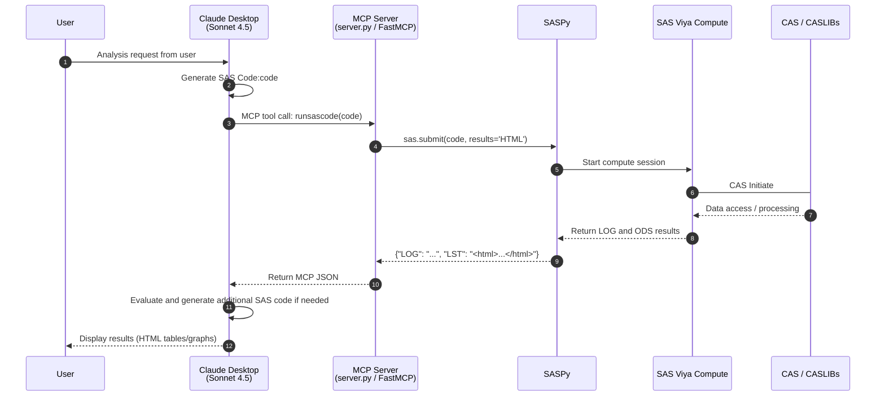

# sastool — A Tiny MCP Server for Running SAS Code via SASPy

This repository contains a minimal **Model Context Protocol (MCP)** server that exposes two SAS-powered tools to an MCP-compatible client (e.g., Claude Desktop):

- `listlibraries` — lists assigned SAS libraries (including CAS libs)
- `runsascode` — executes SAS code and returns SAS log and listing output

It’s built with `FastMCP` and `saspy`.

---
## ⚙️ Features

- ✅ Clean MCP through SAS log and listing output
- ✅ Returns `LOG` and `LST` from SASPy
- ✅ Easy integration with Claude Desktop

## SASPy Configuration
SASPy requires a configuration that specifies how it connects to SAS. To configure SASPy follow the instructions [here](https://sassoftware.github.io/saspy/configuration.html).

## ⚙️ Use with Claude Desktop
### Click to see the demo
[](https://www.loom.com/share/60200b5123604569b64f68519ed527de?sid=de6b7b35-a3a0-4540-8773-668c5c00a002)


Edit your claude_desktop_config.json:
```json
{
  "mcpServers": {
    "sastool": {
      "command": ",/absolute/path/to/.venv/bin/python or uv>",
      "args": ["run", "--with", "mcp[cli]","/absolute/path/to/server.py"],
      "env": {
        "SAS_CONFIG_NAMES": "default",
        "PYTHONUNBUFFERED": "1"
      },
      "disabled": false
    }
  }
}
```
### Example flow with Claude


